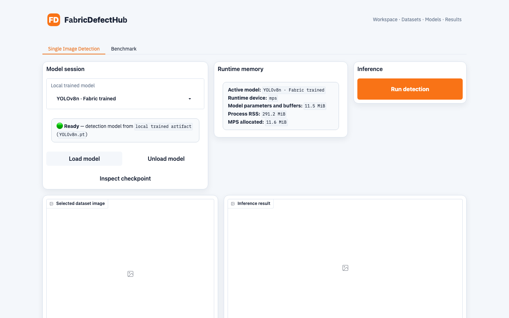

# FabricDefectHub

A unified defect-detection benchmark platform for real-world fabric quality inspection — one dataset/model/evaluation/on-device-performance interface across YOLO-style detectors, two-stage detectors (Faster/Mask R-CNN), and anomaly-detection models (PatchCore, PaDiM, ...).

> [!IMPORTANT]
> This project is currently in the design and early-development stage. Interfaces and directory layout will keep evolving. **[See the Wiki](https://github.com/aurora0543/FabricDefectHub/wiki) for the full architecture, CLI reference, edge-deployment (quantization/power) guide, and roadmap** — this README stays intentionally short.

Two requirements files, no `pip install -e ".[extra]"` bracket-juggling: `requirements.txt` is the lean UI/inference-only set (also what Hugging Face Spaces auto-installs from, paired with the root `app.py`); `requirements-full.txt` installs every model backend, the test suite, and this package itself (editable) in one shot for local/cloud development.

## UI: Single Image Detection



The Gradio workspace (`fdh-ui`) is a thin client over the same backend the CLI drives — it never holds a model object of its own, only calls `load`/`predict`/`unload`. The **Single Image Detection** tab:

- picks a local trained checkpoint (or a pretrained one) from a dropdown and loads it into a resident inference session (auto-selected CUDA/Apple MPS/CPU);
- shows real runtime numbers while the session is alive — model parameter/buffer size, process RSS, and CUDA/MPS allocated memory;
- runs detection/segmentation/anomaly inference on a sampled or selected image and renders boxes, masks, or anomaly maps.

```bash
pip install -r requirements.txt
fdh-ui
```

See the [Gradio Workspace wiki page](https://github.com/aurora0543/FabricDefectHub/wiki/Gradio-Workspace) for session details and the current page list.

## CLI

The same backend is driven headlessly by three `fdh` subcommands:

```bash
pip install -r requirements-full.txt
fdh train configs/models/ultralytics_example.yaml   # unified entry point: train/val/export one model, config-driven
fdh run configs/models/ultralytics_example.yaml      # what fdh train reduces to with no extra flags
fdh benchmark configs/benchmark_example.yaml         # cross-backend leaderboard
```

`fdh train` also resolves a model by filename or keyword (`fdh train yolov8n`), and can override dataset/shot-mode without touching the YAML (`--mode test` for an 8-image pipeline smoke check, `--dataset`, `--num-samples`, ...). Post-training quantization (fp16 / INT8) and TensorRT engine building live in `tools/export_model.py` for edge deployment. Full flag reference: **[CLI Usage](https://github.com/aurora0543/FabricDefectHub/wiki/CLI-Usage)** and **[Edge Deployment](https://github.com/aurora0543/FabricDefectHub/wiki/Edge-Deployment)** on the wiki.

## Learn More

| Wiki page | Covers |
| --- | --- |
| [Architecture](https://github.com/aurora0543/FabricDefectHub/wiki/Architecture) | Project vision, `DatasetAdapter`/`ModelAdapter`/`Evaluator`/`BackendProfiler` design, unified JSON contracts, directory layout |
| [CLI Usage](https://github.com/aurora0543/FabricDefectHub/wiki/CLI-Usage) | `fdh run`/`train`/`benchmark`, all flags and examples |
| [Gradio Workspace](https://github.com/aurora0543/FabricDefectHub/wiki/Gradio-Workspace) | UI pages and the inference-session mechanism |
| [Edge Deployment](https://github.com/aurora0543/FabricDefectHub/wiki/Edge-Deployment) | Quantization (fp16/INT8) and cross-platform power measurement |
| [Roadmap & Fair Benchmarking](https://github.com/aurora0543/FabricDefectHub/wiki/Roadmap-and-Benchmarking) | Phased roadmap and what a published benchmark result must report |

See also [VALIDATION.md](VALIDATION.md) for what's been verified locally vs. what still needs real hardware (Jetson, CUDA, TensorRT).

## License

This project is licensed under the [MIT License](LICENSE). Third-party frameworks, model weights, and datasets remain subject to their own licenses and terms of use.

## Contact

This project was initiated by, and is under active development at, a research group at Beijing Institute of Technology. For collaboration, dataset adaptation, or benchmark submission suggestions, please reach out to the maintainers via an Issue.
